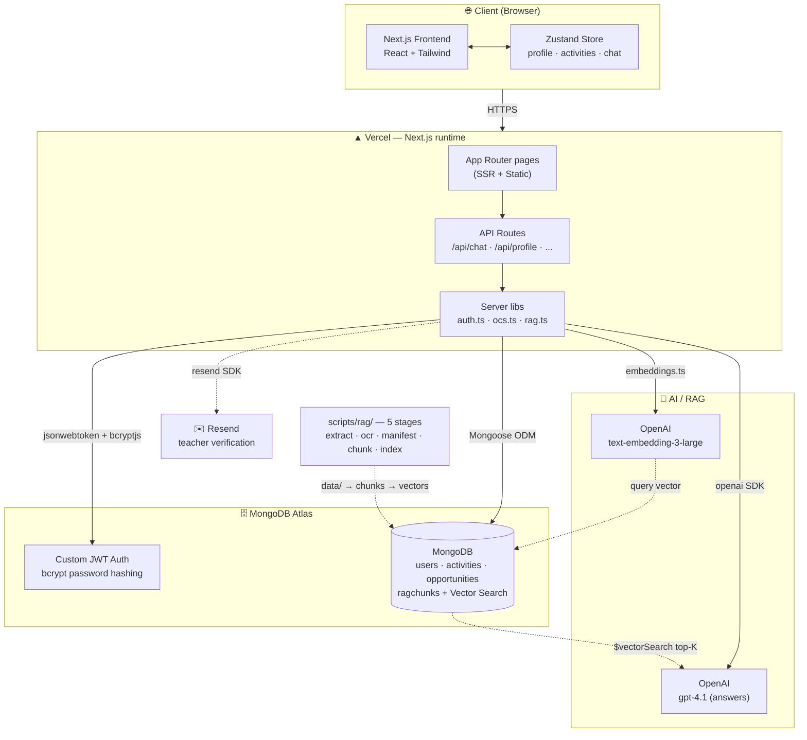

# Green STEM Compass

A Vietnamese STEM admissions platform helping high school students (grades 10–12) plan their university applications to the "Big 6" schools: VinUni, HUST, USTH, VJU, FPT, and Swinburne Vietnam.

🌐 **Live:** https://thegreenpassport-weld.vercel.app

---

## Architecture



### Request flow examples

**Register / Login:**
1. User submits the register or login form (`/register`, `/login`)
2. `POST /api/auth/register` (hashes password with bcrypt, creates the user document, signs a JWT) or `POST /api/auth/login` (verifies password, signs a JWT)
3. Client stores `{ token, user }` in `localStorage` and sends `Authorization: Bearer <token>` on every subsequent API call

**Chatbot query (RAG):**
1. User asks question in `/chatbot` (React)
2. `POST /api/chat` with the JWT
3. Server: verify JWT → detect which school the question names → embed the query (`text-embedding-3-large`) → run `$vectorSearch` over the `ragchunks` collection for top-K passages, filtered to that school and cut off at a relevance threshold → if nothing clears the threshold, return the "no grounded answer" message without calling the model → otherwise call OpenAI with the passages, ready-made citation strings, and chat history → stream the response back
4. Client renders the markdown reply with `react-markdown`

**Save portfolio activity:**
1. User submits form on `/portfolio` (react-hook-form + Zod)
2. `POST /api/activities`
3. Server: verify JWT → Zod schema check → Mongoose `create()` into MongoDB
4. Client updates Zustand store (persisted to localStorage)

---

## Tech Stack

### Framework / Core
- **Next.js 16** (App Router) — pages, SSR, API routes
- **React 18** + **TypeScript**

### Database & Auth
- **MongoDB Atlas** — managed MongoDB, used for both local dev and production
- **Mongoose** — schema/ODM layer over MongoDB
- **jsonwebtoken** + **bcryptjs** — custom auth: password hashing + stateless JWT sessions (no third-party auth provider)

### AI / RAG
- **OpenAI** (`openai`) — chatbot answers (`gpt-4.1` by default) and `text-embedding-3-large` vectors for both indexing and queries
- **MongoDB Atlas Vector Search** — the corpus lives in the `ragchunks` collection of the same cluster as the app data, so the team and every deployment share one copy with no extra service to host
- **Anthropic Claude** (`@anthropic-ai/sdk`) — offline ingest only: transcribing scanned PDFs and reading document metadata. Not on the request path
- **pdf-parse** — per-page PDF text extraction and page rendering during ingest
- **mammoth** — DOCX text extraction
- **sharp** — page image compression before OCR

### UI
- **Tailwind CSS** + `tailwindcss-animate` + `@tailwindcss/typography`
- **@base-ui/react** — headless UI primitives (`components/ui/`)
- **lucide-react** — icons
- **framer-motion** — animations
- **recharts** — dashboard charts
- **react-markdown** — chatbot output rendering
- **@dnd-kit/\*** — drag-and-drop (portfolio reordering)
- **next-themes** — dark/light mode
- **class-variance-authority**, **clsx**, **tailwind-merge** — class composition

### Forms & Validation
- **react-hook-form** + `@hookform/resolvers`
- **Zod** — schema validation (client + server)

### State
- **Zustand** — client-side global state with localStorage persistence

### Email
- **Resend** — teacher verification emails (TrustFactor Tier 2, optional)

### Hosting
- **Vercel** — hosts the Next.js app, auto-deploys from `main`
- **MongoDB Atlas** — managed database, free M0 tier is enough to start

---

## Project Structure

```
src/
├── app/
│   ├── (app)/               # FRONTEND — authenticated app pages
│   │   ├── dashboard/       # Main dashboard with OCS score & profile summary
│   │   ├── compass/         # Strategic Matching — gap analysis vs Big 6 schools
│   │   ├── portfolio/       # 10-Slot Portfolio Optimizer (STAR format)
│   │   ├── opportunities/   # STEM competitions, scholarships, workshops
│   │   ├── chatbot/         # AI advisor chatbot (RAG-powered)
│   │   ├── mentor/          # Mentor connection page
│   │   ├── profile/         # Profile settings (GPA, SAT, IELTS, school)
│   │   └── layout.tsx       # App layout with Sidebar + AuthDataLoader
│   │
│   ├── (auth)/              # FRONTEND — login & register pages
│   │   ├── login/
│   │   └── register/
│   │
│   ├── demo/                # FRONTEND — public demo (no login required)
│   │
│   ├── api/                 # BACKEND — Next.js API routes
│   │   ├── profile/         # GET/POST/PUT user profile
│   │   ├── activities/      # GET/POST/DELETE portfolio activities
│   │   ├── chat/            # POST — RAG chatbot endpoint (OpenAI + Atlas Vector Search)
│   │   ├── opportunities/   # GET opportunities list
│   │   ├── mentor/          # GET mentors, POST connection request
│   │   ├── ocs/calculate/   # POST — Overall Competency Score calculation
│   │   ├── compass/analyze/ # POST — school match analysis
│   │   ├── auth/lookup-username/ # GET — resolve username to email for login
│   │   └── admin/           # Admin endpoints (trust verification, opportunities)
│   │
│   └── page.tsx             # FRONTEND — landing page
│
├── components/
│   ├── shared/
│   │   ├── Topbar.tsx       # FRONTEND — top bar with auth dropdown / demo switcher
│   │   ├── AuthDataLoader.tsx # FRONTEND — loads real DB data into Zustand on login
│   │   ├── ThemeToggle.tsx  # FRONTEND — dark/light mode toggle
│   │   └── TrustBadge.tsx   # FRONTEND — trust tier badge component
│   └── ui/                  # FRONTEND — @base-ui/react primitives
│
├── backend/
│   ├── db/
│   │   ├── mongoose.ts      # BACKEND — cached MongoDB connection singleton
│   │   └── models/          # BACKEND — Mongoose schemas (User, Activity, Opportunity, ...)
│   ├── auth.ts              # BACKEND — JWT sign/verify + requireAuth()/isAdmin() helpers
│   ├── rag.ts                # AI RAG — retrieval + answer streaming
│   ├── embeddings.ts         # AI RAG — shared OpenAI embedding client
│   ├── openai.ts             # AI RAG — shared OpenAI client + chat model choice
│   ├── nlp-tagger.ts         # AI — auto-tags activities with tech keywords
│   └── rocketchat.ts         # BACKEND — optional admin notification webhook
│
├── shared/
│   ├── auth-client.ts       # FRONTEND — JWT session helpers (localStorage-backed)
│   ├── ocs.ts                # BACKEND/FRONTEND — Overall Competency Score logic
│   ├── matching.ts           # BACKEND/FRONTEND — school matching & unrealistic goal detection
│   ├── constants.ts          # FRONTEND — Big 6 school data, category labels/colors
│   └── demoUsers.ts          # FRONTEND — seed data for demo mode
│
├── store/
│   └── useProfileStore.ts   # FRONTEND — Zustand store (profile + activities state)
│
└── types/
    └── index.ts             # Shared TypeScript types
```

---

## Frontend

All pages under `src/app/(app)/`, `src/app/(auth)/`, `src/app/demo/`, and `src/app/page.tsx`.

Responsibilities:
- Renders the UI with Tailwind CSS (dark/light mode via `next-themes`)
- Manages client state via Zustand (`useProfileStore`)
- Handles auth session via `src/shared/auth-client.ts` (JWT stored in `localStorage`)
- Demo mode: uses hardcoded seed data from `demoUsers.ts`, no login required

---

## Backend

All routes under `src/app/api/` plus `src/backend/db/` and `src/backend/auth.ts`.

Responsibilities:
- REST API endpoints for auth, profile, activities, opportunities, mentors
- Authentication via a self-issued JWT (Bearer token on every request), verified in `src/backend/auth.ts`
- Password hashing with bcrypt; no third-party auth provider
- Database access via Mongoose → MongoDB Atlas
- OCS score calculation and school match logic
- Admin endpoints for trust verification and opportunity management

---

## AI / RAG

### Query path

Files: `src/backend/rag.ts`, `src/backend/embeddings.ts`, `src/backend/openai.ts`, `src/shared/schools.ts`, `src/app/api/chat/route.ts`

- **`rag.ts`** — retrieval and answering. Three details matter:
  - The query is embedded with `text-embedding-3-large`, the same model the ingest uses. Vectors from two different models are not comparable, and mixing them fails silently as poor retrieval rather than as an error.
  - When the question names a school, retrieval filters to that school's documents first, so a HUST question doesn't compete against 24 other schools' chunks.
  - Passages below a similarity floor are dropped. `$vectorSearch` returns its nearest N no matter how unrelated they are, so without the cutoff the "no grounded answer" branch could never fire and the model would be handed irrelevant text for every off-topic question. Measured on this corpus, on-topic questions score 0.767–0.848 and clearly off-topic ones 0.624–0.697, so the floor sits at 0.73. **Re-measure it if the embedding model changes** — the value cannot be carried over or derived arithmetically.
- **`schools.ts`** — school registry and alias matching. Codes must match the `school` values in `data/manifest.json`; `scripts/rag/index.ts` diffs the two on every run and reports drift.
- **`api/chat/route.ts`** — auth, validation, streaming. Scope comes from the corpus, not from a keyword blocklist: a school with no indexed documents simply retrieves nothing.
- **`nlp-tagger.ts`** — keyword-tags portfolio activities with tech/skill labels (unrelated to the chatbot).

### Ingest pipeline

Source documents live in `data/` (git-ignored — they are large binaries). Five stages under `scripts/rag/`, each writing to `.cache/rag/` so any stage can be re-run alone:

| Stage | Command | What it does |
|---|---|---|
| 1 | `npm run rag:extract` | Per-format adapters → per-page text. Deduplicates by content hash; flags PDFs with no text layer |
| 2 | `npm run rag:ocr` | Renders scanned pages to JPEG and transcribes them with Claude vision via the Batch API. Run twice: once to submit, once to collect |
| 3 | `npm run rag:manifest` | Bootstraps `data/manifest.json` by reading each document's letterhead. **Review this by hand** — every citation is built from it |
| 4 | `npm run rag:chunk` | Splits on `Chương`/`Điều` and section headings, prefixes each chunk with its document and section for the embedding |
| 5 | `npm run rag:index` | Embeds and upserts into the `ragchunks` collection, creates the Atlas vector index if absent, and drops chunks whose source document left the corpus |

`data/manifest.json` **is** tracked, unlike the documents themselves: it is curated metadata, and regenerating it means redoing the human review.

Only stages 2 and 3 need `ANTHROPIC_API_KEY`; stage 5 needs `OPENAI_API_KEY`.

### Where the corpus lives

`ragchunks` sits in the same Atlas cluster as the app's other collections, so running stage 5 once publishes the corpus to everyone — teammates and every deployment read the same copy. There is no separate vector-store service to host and no separate deploy step.

The vector index (`rag_vector_index`) is created automatically by stage 5 on first run. Atlas builds it in the background; queries return nothing until it reports `queryable: true`, usually within a minute.

At 1,398 chunks the corpus takes about 58 MB of the 512 MB free tier.

---

## Getting Started

1. **Create a MongoDB Atlas cluster** (free M0 tier is enough): [cloud.mongodb.com](https://cloud.mongodb.com) → Database → Connect → Drivers → copy the `mongodb+srv://...` connection string. Under Network Access, allow access from anywhere (`0.0.0.0/0`) — this is required for both local dev (dynamic IP) and Vercel (no static IPs on the default tier).
2. **Fill in `.env.local`:**

```bash
npm install
cp .env.example .env.local   # fill in MONGODB_URI, JWT_SECRET, ANTHROPIC_API_KEY, etc.
```

3. **Seed reference data (school personas + opportunities) and run:**

```bash
npm run db:seed
npm run dev
```

4. Open `http://localhost:3000/register` and create an account — no separate database migration step is needed (MongoDB is schemaless; Mongoose creates collections/indexes on first write).

For the RAG chatbot, build the corpus. Put the source documents (PDF/DOCX) in `data/`, then run the five ingest stages — see AI / RAG above for what each does:

```bash
npm run rag:extract
npm run rag:ocr        # twice: submit, then collect. Skip if no scanned PDFs
npm run rag:manifest   # then review data/manifest.json by hand
npm run rag:chunk
npm run rag:index
```

---

## Running with Docker

The project ships with a multi-stage production `Dockerfile`, a `Dockerfile.dev` for hot reload, and and a `docker-compose.yml` for running the app in a container.

### Local development (recommended)

Brings up Next.js with hot reload. Both the app data and the RAG corpus live in MongoDB Atlas (cloud), so `.env.local` is used as-is inside the container — there is no local datastore to point at.

```bash
cp .env.example .env.local   # fill in MONGODB_URI, JWT_SECRET, Anthropic keys
docker compose up app          # build + start the app
# App: http://localhost:3000

docker compose logs -f app   # tail app logs
docker compose down          # stop
```

The compose file also defines `mongodb`, `mongodb-init`, and `rocketchat` services — those back an optional, unrelated admin-notification feature (Rocket.Chat), not the app's own database. Add them to the `up` command (or run `docker compose up` with no service list) only if you want that feature too; see `docs/rocketchat.md`.

The ingest stages are host-side tooling, not part of the container — run them with `npm run rag:*` as described above. They write to Atlas, so the container sees the result without any extra step.

### Production image

Multi-stage build using Next.js standalone output. Final image is ~276 MB, runs as non-root.

```bash
docker build -t greenstem .
docker run -p 3000:3000 --env-file .env.local greenstem
```

Deploy this image to any container host — Fly.io, Render, AWS ECS, Google Cloud Run, or a plain VPS. Set the same environment variables documented below.

**Troubleshooting:** If `docker build` fails with `apk add` DNS errors (`dl-cdn.alpinelinux.org: name does not exist`), it's a BuildKit network namespace issue on Docker Desktop. Rebuild with the host network:

```bash
docker build --network=host -t greenstem .
```

### File layout

| File | Purpose |
|------|---------|
| `Dockerfile` | Multi-stage production build (deps → builder → runner) |
| `Dockerfile.dev` | Development image used by `docker compose` for hot reload |
| `docker-compose.yml` | Local app container, plus optional Rocket.Chat + MongoDB services |
| `.dockerignore` | Excludes `node_modules`, `.env*`, `.next`, `data/`, etc. |

---

## Environment Variables

| Variable | Description |
|----------|-------------|
| `MONGODB_URI` | MongoDB Atlas connection string (same cluster for local dev and production) |
| `JWT_SECRET` | Long random secret used to sign/verify auth JWTs — keep it secret, never commit it |
| `JWT_EXPIRES_IN` | JWT session lifetime, e.g. `7d` |
| `OPENAI_API_KEY` | **Required for the chatbot.** One key covers both answer generation and the retrieval embeddings |
| `OPENAI_CHAT_MODEL` | Optional. Defaults to `gpt-4.1` — see `src/backend/openai.ts` for why a reasoning model is not the default |
| `ANTHROPIC_API_KEY` | Offline ingest only (OCR + document metadata). The running app never calls Anthropic |
| `NEXT_PUBLIC_APP_URL` | Deployed app URL |
| `RAG_DATA_FRESHNESS_DATE` | Date shown in chatbot "data current as of" disclaimer |
| `ADMIN_USER_IDS` | Comma-separated MongoDB `_id` strings (from the `users` collection) with admin access |
| `RESEND_API_KEY` | Resend API key (optional — for teacher verification email) |
| `RESEND_FROM_EMAIL` | Sender address for Resend |

---

## Deployment

Deployed on **Vercel** (Next.js app) and **MongoDB Atlas** (app data + RAG corpus).

- **Vercel** — every push to `main` triggers an automatic redeployment. Set `MONGODB_URI`, `JWT_SECRET`, `JWT_EXPIRES_IN`, `OPENAI_API_KEY`, `ADMIN_USER_IDS`, and the rest of the table above as Vercel project environment variables (Project Settings → Environment Variables). `OPENAI_API_KEY` is required — without it `/api/chat` returns 500. `ANTHROPIC_API_KEY` is not needed in production; it is only used by the local ingest scripts.
- **The corpus ships with the database, not the code.** Because `ragchunks` lives in the same Atlas cluster, a deployment picks it up automatically — no separate publish step.
- **MongoDB Atlas** — under Network Access, allow access from anywhere (`0.0.0.0/0`); Vercel's serverless functions don't have static outbound IPs on the default tier, so per-IP allowlisting isn't practical here.
