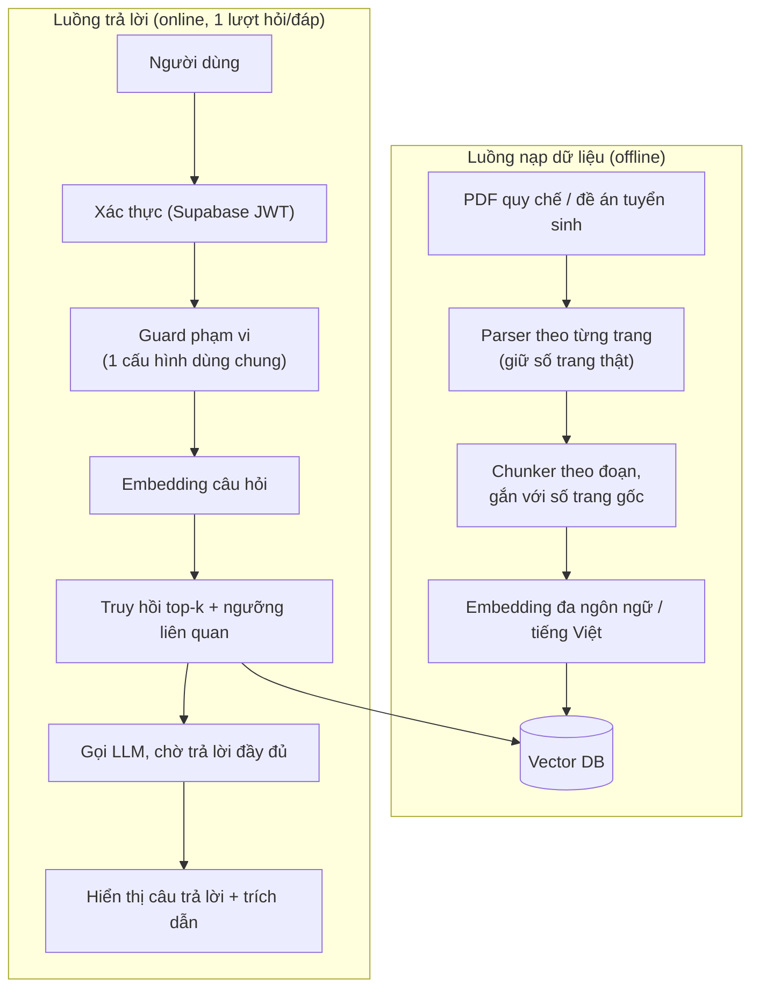

# RAG Chatbot — Kế hoạch xây dựng lại từ đầu

Tài liệu này **không phải** danh sách vá lỗi cho từng phần rời rạc của bản hiện tại. Đây là bản thiết kế build lại tính năng RAG Chatbot (trợ lý AI tư vấn tuyển sinh có trích dẫn nguồn) từ đầu, thu gọn đúng vào mục tiêu hiện tại: **người dùng hỏi, chatbot trả lời trong phạm vi dữ liệu được cung cấp** — một lượt hỏi/đáp, có trích dẫn nguồn thật, từ chối khi ngoài phạm vi.

Các phần streaming thời gian thực, bộ nhớ hội thoại nhiều lượt, giới hạn tần suất (rate limit) và logging/alerting nâng cao **không nằm trong phạm vi bản này** — để làm sau khi lõi hỏi-đáp đã chạy đúng và ổn định.

## 1. Mục tiêu tính năng

- Trợ lý AI tư vấn tuyển sinh cho 6 trường: **VinUni, HUST, USTH, VJU, FPT, Swinburne Vietnam**.
- Mỗi câu trả lời đều đi kèm trích dẫn nguồn thật (tên tài liệu, số trang, ngày ban hành).
- Từ chối trả lời khi câu hỏi ngoài phạm vi dữ liệu hoặc ngoài 6 trường, thay vì suy diễn.
- Người dùng đã xác thực gửi 1 câu hỏi → chatbot trả lời 1 lần, đầy đủ, kèm trích dẫn (không cần streaming, không cần nhớ ngữ cảnh nhiều lượt ở giai đoạn này).

**Ngoài phạm vi giai đoạn này** (cân nhắc làm sau khi lõi Q&A ổn định): streaming câu trả lời theo thời gian thực, bộ nhớ hội thoại nhiều lượt, giới hạn tần suất theo người dùng, logging/alerting nâng cao.

## 2. Kiến trúc tổng thể

## 3. Quyết định thiết kế nền tảng

| Lớp | Quyết định thiết kế | Vì sao phải xây đúng ngay từ đầu |
|---|---|---|
| Ingestion PDF | Parse và giữ ranh giới từng trang thật khi chunk, gắn `page` vào mỗi chunk từ vị trí gốc trong file, không suy ra từ chỉ số chunk | Trích dẫn quy chế tuyển sinh bắt buộc đúng số trang; sai số trang khiến học sinh tra nhầm văn bản gốc |
| Embedding | Chọn mô hình embedding đa ngôn ngữ/tiếng Việt (vd `text-embedding-3` hoặc multilingual-e5) thay vì để vector DB tự dùng embedder mặc định tối ưu cho tiếng Anh | Toàn bộ tài liệu và câu hỏi đều là tiếng Việt; embedder tiếng Anh mặc định làm giảm chất lượng truy hồi ngay từ gốc |
| Hợp đồng dữ liệu (data contract) | Định nghĩa một schema `Citation` duy nhất (nguồn, trang, ngày ban hành, đoạn trích) dùng chung cho backend và frontend, sinh type từ một nguồn duy nhất | Tránh lệch tên trường giữa hai phía khiến trích dẫn hiển thị rỗng khi nối hệ thống thật |
| Truy hồi (retrieval) | Có ngưỡng độ liên quan (similarity/distance threshold) áp dụng cho mọi kết quả trả về, không chỉ xử lý riêng trường hợp 0 kết quả | Tránh việc luôn lấy top-k dù không đoạn nào thực sự liên quan, rồi AI cố ghép câu trả lời sai |
| Trả lời (request/response) | API trả lời đồng bộ: nhận câu hỏi, chờ LLM xử lý xong, trả về JSON `{answer, citations}` trong một lần | Đúng với mục tiêu hỏi-đáp 1 lượt hiện tại; không cần hạ tầng streaming khi chưa cần trải nghiệm gõ chữ theo thời gian thực |
| Guard phạm vi | Một cấu hình duy nhất cho danh sách 6 trường + quy tắc từ chối ngoài phạm vi, dùng lại ở system prompt, guard backend, guard frontend và endpoint mô tả — không hard-code nhiều nơi | Quy tắc lặp ở nhiều nơi dễ lệch nhau theo thời gian và dễ bị lách nếu mỗi nơi dùng logic khác nhau |

## 4. Lộ trình xây dựng theo giai đoạn

### Giai đoạn 0 — Nền tảng dữ liệu
Xây pipeline ingestion đúng ngay từ đầu: parser giữ số trang thật, chunker gắn kèm trang gốc, chọn và cấu hình embedding đa ngôn ngữ/tiếng Việt, nạp lại toàn bộ 7 tài liệu nguồn (6 đề án tuyển sinh + Thông tư 06/2026/TT-BGDĐT) vào vector DB.

### Giai đoạn 1 — Lõi RAG kết nối thật
Xây API trả lời đồng bộ thật (không còn dữ liệu demo dựng sẵn), giao diện chat gọi thẳng API này có xác thực người dùng, và mang theo trích dẫn nguồn đúng theo schema dùng chung trong cùng một lần trả lời.

### Giai đoạn 2 — Độ tin cậy câu trả lời
Thêm ngưỡng độ liên quan vào bước truy hồi để hệ thống biết từ chối thay vì ghép câu trả lời từ đoạn không ăn nhập; gộp quy tắc phạm vi "chỉ trả lời về 6 trường" về một cấu hình dùng chung cho toàn hệ thống; đánh giá lại chất lượng truy hồi sau khi đổi embedding ở Giai đoạn 0.

## 5. Gợi ý chia nhóm song song

- **Nhóm A — Dữ liệu & độ tin cậy:** Giai đoạn 0 và Giai đoạn 2 (ingestion đúng trang, embedding tiếng Việt, ngưỡng liên quan, gộp guard phạm vi).
- **Nhóm B — Kết nối API thật:** Giai đoạn 1 (API đồng bộ, trích dẫn đúng, bỏ dữ liệu demo). Cần dữ liệu đã nạp đúng từ Nhóm A trước khi đánh giá chất lượng câu trả lời cuối cùng, nhưng có thể bắt đầu song song trên dữ liệu tạm.

## 6. Bóc tách công việc chi tiết theo từng giai đoạn

Mỗi việc dưới đây có thể giao cho một người làm độc lập. Effort: **N** = vài giờ, **V** = 0.5–1 ngày, **L** = nhiều ngày.

### Giai đoạn 0 — Nền tảng dữ liệu (Nhóm A)

| # | Việc | Mô tả | Khu vực liên quan | Effort | Phụ trách |
|---|---|---|---|---|---|
| 0.1 | Parser PDF theo trang | Thay vì đọc toàn bộ PDF thành 1 chuỗi text, parse theo từng trang (giữ ranh giới trang thật) để có thể gắn số trang chính xác cho từng đoạn văn bản | `scripts/ingest-rag.ts` | V | |
| 0.2 | Chunker gắn trang gốc | Sửa bước chia nhỏ văn bản để mỗi chunk mang theo số trang thật lấy từ bước 0.1, bỏ công thức suy đoán `chunk_index / 3 + 1` | `scripts/ingest-rag.ts` | N | |
| 0.3 | Chọn mô hình embedding tiếng Việt/đa ngôn ngữ | So sánh 2–3 lựa chọn (vd OpenAI `text-embedding-3-small`, Cohere multilingual, hoặc model open-source multilingual-e5), chốt 1 phương án theo chi phí/độ chính xác | Tài liệu quyết định + cấu hình env | N | |
| 0.4 | Tích hợp embedding function vào Chroma (phía ingest) | Truyền `embeddingFunction` tùy chỉnh khi tạo/nạp collection thay vì để Chroma dùng default | `scripts/ingest-rag.ts` | V | |
| 0.5 | Tích hợp embedding function vào Chroma (phía query) | Đảm bảo câu hỏi người dùng cũng được encode bằng đúng model đã chọn ở 0.3, khớp với dữ liệu đã nạp | `src/backend/rag.ts` (`retrievePassages`) | V | |
| 0.6 | Nạp lại toàn bộ corpus | Chạy lại `rag:ingest` với pipeline mới cho 7 tài liệu nguồn (6 đề án tuyển sinh + Thông tư 06/2026/TT-BGDĐT), kiểm tra thủ công vài chunk để xác nhận số trang đúng | `corpus/`, Chroma collection `green_stem_corpus` | N | |
| 0.7 | Bộ câu hỏi mẫu để đánh giá truy hồi | Soạn ~15–20 câu hỏi thật (theo từng trường) kèm đáp án/nguồn kỳ vọng, dùng làm baseline so sánh trước/sau khi đổi embedding | Tài liệu test riêng (vd `docs/rag-eval-set.md`) | N | |

### Giai đoạn 1 — Lõi RAG kết nối thật (Nhóm B)

| # | Việc | Mô tả | Khu vực liên quan | Effort | Phụ trách |
|---|---|---|---|---|---|
| 1.1 | Schema `Citation` dùng chung | Định nghĩa 1 Zod schema duy nhất cho citation (nguồn/document, trang, ngày ban hành, đoạn trích), export type dùng cho cả 2 phía thay vì định nghĩa riêng ở `src/types/index.ts` | File mới, vd `src/shared/schemas/citation.ts` | N | |
| 1.2 | Chuẩn hoá field trả về ở backend | Đổi response của `ragChat` để dùng đúng tên field theo schema 1.1 (không còn `source`/`date` lệch với `document`/`published_date`) | `src/backend/rag.ts` | N | |
| 1.3 | API trả lời đồng bộ (không streaming) | Endpoint nhận câu hỏi, gọi LLM, chờ xử lý xong rồi trả về JSON `{answer, citations}` trong một lần — không cần định dạng SSE hay xử lý luồng token | `src/backend/rag.ts` (`ragChat`), `src/app/api/chat/route.ts` | V | |
| 1.4 | Bỏ dữ liệu demo, gọi API thật | Xoá `DEMO_CHAT`/`selectDemoAnswer`/`setTimeout` giả lập, gọi `fetch('/api/chat')` thật kèm `Authorization` header lấy từ session Supabase | `src/app/(app)/chatbot/page.tsx`, `src/shared/constants.ts` | V | |
| 1.5 | Hiển thị câu trả lời + trích dẫn đúng field | Nhận JSON trả về, hiển thị câu trả lời và citation theo đúng field đã chuẩn hoá ở 1.1–1.2 | `src/app/(app)/chatbot/page.tsx` | N | |
| 1.6 | Test end-to-end luồng thật | Kiểm thử thủ công/tự động: đăng nhập → hỏi → nhận câu trả lời thật kèm trích dẫn đúng, không còn phụ thuộc dữ liệu demo | Toàn luồng chat | N | |

### Giai đoạn 2 — Độ tin cậy câu trả lời (Nhóm A)

| # | Việc | Mô tả | Khu vực liên quan | Effort | Phụ trách |
|---|---|---|---|---|---|
| 2.1 | Đọc điểm liên quan từ Chroma | Lấy thêm `distances`/scores từ kết quả query thay vì chỉ đọc `documents`/`metadatas` | `src/backend/rag.ts` (`retrievePassages`) | N | |
| 2.2 | Thêm ngưỡng lọc kết quả | Thêm hằng số/biến môi trường ngưỡng (threshold), lọc bỏ passage có điểm liên quan dưới ngưỡng trước khi đưa vào prompt | `src/backend/rag.ts` | N | |
| 2.3 | Đường dẫn từ chối khi dưới ngưỡng | Đảm bảo khi tất cả passage bị lọc hết (không chỉ khi 0 kết quả trả về), hệ thống trả đúng câu "không tìm thấy thông tin" | `src/backend/rag.ts` | N | |
| 2.4 | Gộp cấu hình phạm vi "6 trường" về một nơi | Tạo 1 file cấu hình duy nhất (danh sách trường + rule out-of-scope), export dùng lại ở: system prompt, guard backend, guard frontend, endpoint mô tả (`GET /api/chat`) | File mới, vd `src/shared/config/scope.ts`; sửa `src/backend/rag.ts`, `src/app/api/chat/route.ts`, `src/app/(app)/chatbot/page.tsx` | V | |
| 2.5 | Dọn các bản định nghĩa trùng lặp cũ | Xoá danh sách trường/keyword hard-code rải rác sau khi đã chuyển sang dùng cấu hình chung ở 2.4 | Như trên | N | |
| 2.6 | Bộ câu hỏi mẫu để test (mở rộng) | Mở rộng bộ câu hỏi mẫu ở 0.7 thêm câu ngoài phạm vi/match yếu, dùng để xác nhận hệ thống từ chối đúng thay vì suy diễn | Tài liệu test 0.7 | N | |
| 2.7 | Đánh giá lại chất lượng truy hồi & chốt ngưỡng | So sánh kết quả trước/sau (embedding mới + ngưỡng mới) trên bộ câu hỏi mẫu, chốt lại giá trị ngưỡng phù hợp | Tài liệu đánh giá | V | |
